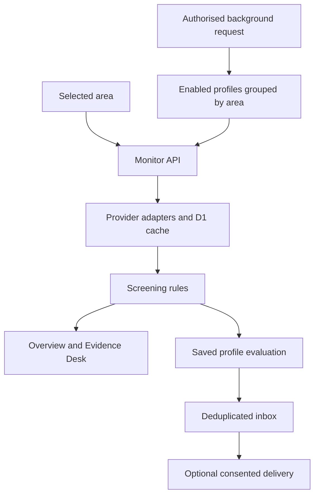

# Prithvi — Disaster Observatory

A calm, India-focused monitoring and learning application. **Help people prepare. Explain the science. Build with evidence.**

Prithvi is a research prototype, not an official warning service. Follow NDMA Sachet, IMD, CWC and district authorities for emergency decisions. No reliable 24–48-hour earthquake prediction is offered.

The long-term goal is a multimodal disaster intelligence platform. The current implementation combines structured environmental feeds, transparent screening rules, and two reproducible machine-learning experiments. It helps people explore an area, understand a signal, save monitoring preferences and practise decisions before an emergency happens.

[Developer handbook](public/downloads/Prithvi_Developer_Handbook.pdf) · [Model report](ml/artifacts/model-report.json) · [Source archive](public/downloads/Prithvi_Source.zip) · [MIT license](LICENSE)

## Scope at a glance

| Component | Implemented | Current boundary |
|---|---|---|
| Overview and Evidence Desk | Five hazard views, graphs, exact tables, CSV exports, timestamps and retry controls | Research signals; unavailable evidence stays unavailable |
| Floods | 48-hour rainfall screening and seven-day modelled river discharge | No street-level inundation, damage prediction or calibrated river thresholds |
| Droughts | Thirty-day rainfall and dry-day screening | No official drought diagnosis or seasonal normalisation |
| Earthquakes | Recorded USGS events with magnitude, depth, time and location | No future occurrence prediction |
| Acid deposition | Modelled SO₂/NO₂ concentrations and educational context | No measured rainwater pH or acid-rain danger alerts |
| Cyclones | GDACS reports, city distance and forecast wind context | No independently predicted track, surge or impact footprint |
| History | Annual weather explorer and eight documented event cases | Not a complete disaster catalogue or recurrence forecast |
| Accounts and watches | One saved monitoring area per user, thresholds, opt-in flags and inbox | Production identity depends on the hosting authentication boundary |
| Preparedness | Five guides, five fictional decision simulations, household plan and checklist | Educational practice; no live emergency simulation or dispatch |
| Notifications | In-app watches, browser notifications and optional email | No SMS, closed-browser Web Push or durable delivery queue |
| ML research | Trained rainfall and dry-week models, data, artifacts and reports | Retrospective weather proxies; independent of live alert decisions |
| Multimodal extension | Entry point for verified labels and numeric `feature_*` inputs | No trained image/audio/text encoders or validated fusion model yet |

**Supported areas:** Bhubaneswar, Siliguri, Kolkata, Mumbai, Chennai, New Delhi, Guwahati, Kochi, Jaipur and Visakhapatnam. Coordinates are defined in [`lib/locations.ts`](lib/locations.ts). Included ML data covers Bhubaneswar, Kolkata and Jaipur only.

## What works

- Five hazard views: flood-related rainfall screening, dry-spell monitoring, recorded earthquakes, acid-deposition precursors and regional cyclone reports.
- Live Open-Meteo weather, GloFAS river discharge, CAMS SO₂/NO₂, USGS events and GDACS cyclone feeds. Each source fails independently and has a retrieval timestamp.
- Ten selectable Indian areas; 2000–2025 monthly and daily rainfall, dry days, heavy-rain days and temperature, with exact tables and CSV export.
- Eight sourced historical cases with event-specific reanalysis or USGS sequence charts. National event metrics and local modelled series are explicitly distinguished. This is not a comprehensive disaster-frequency database.
- ChatGPT sign-in, persistent area/threshold settings, per-user alert inbox, opt-in browser notifications and an optional Resend email adapter.
- An authenticated background monitor endpoint and hourly background checking when the linked Site schedule is enabled.
- Detailed before/during/after guides for all five hazards, five fictional decision simulations, a device-local household plan and emergency-bag checklist, printable/downloadable guidance, and sourced emergency/hospital/police/NGO contacts.
- The Learn & Build section is removed; old `/learn` links redirect to preparedness. Existing handbook, source archive and model artifacts remain available at their download paths.

## How the application works



1. **Choose an area.** The browser stores the viewing preference locally. A signed-in user can separately save one monitoring area, alert threshold and delivery preferences in D1. Browsing an area does not subscribe the user.
2. **Collect evidence.** `lib/feeds.ts` requests six feeds concurrently for an area, normalises provider responses and validates required fields. Each source has its own status and cache lifetime.
3. **Apply explicit rules.** `lib/risk.ts` turns the available measurements into five summaries and keeps missing evidence neutral. These are transparent screening rules, not model-generated disaster probabilities.
4. **Show the evidence.** The dashboard presents the cards; the Evidence Desk exposes charts, exact values, source messages and exports. The included availability fixes preserve the last response after a failed refresh, isolate city changes, bound client requests and initialise graph dimensions.
5. **Evaluate consented watches.** `lib/alerts.ts` checks saved preferences and inserts deduplicated inbox entries. Notification-update failures do not discard successfully retrieved environmental evidence.
6. **Record background checks.** The service endpoint evaluates enabled profiles by area and records counts in `monitor_runs`. An external scheduler must call it; cloning this repository does not create a schedule.

The Python training pipeline is independent of this flow. Loading a `.joblib` artifact does not change the live screening rules.

## Historical evidence and preparedness

The annual explorer covers 2000–2025, with daily values, monthly summaries and CSV exports. Completeness checks treat precipitation and temperature independently, so missing rainfall is not silently interpreted as zero.

| Historical case | Year | Evidence |
|---|---|---|
| Gujarat / Bhuj earthquake | 2001 | Sourced context and USGS event sequence |
| Chennai floods | 2015 | Event context and local reanalysis |
| Gorkha earthquake | 2015 | Sourced context and USGS event sequence |
| Deficient southwest monsoon | 2015 | National context distinguished from local weather |
| Kerala floods | 2018 | Event context and local reanalysis |
| Cyclone Fani | 2019 | Reported event metrics and local reanalysis |
| Cyclone Amphan | 2020 | Reported event metrics and local reanalysis |
| Cyclone Yaas | 2021 | Reported event metrics and local reanalysis |

Case definitions, dates, citations and limitations are in [`lib/historic-events.ts`](lib/historic-events.ts). A local modelled series does not reproduce a cyclone's official maximum intensity or prove that a locality flooded. These selected cases do not estimate recurrence intervals or predict the next occurrence.

The preparedness centre offers before/during/after guidance and five fictional branching exercises about rising water, a coastal cyclone watch, shaking indoors, water restrictions and an air-chemistry graph. Choices are followed by explanations; simulations never issue a real warning. The household plan and emergency-bag checklist stay in browser storage and are not shared with responders. Guides can be printed/downloaded. The separate help page is a sourced contact directory, not live hospital-capacity or dispatch information.

## What the models mean

`ml/train.py` trains a random-forest rainfall regressor and a dry-week classifier on actual historical reanalysis for Bhubaneswar, Kolkata and Jaipur. Training is 2000–2022, validation is 2023, and held-out testing is 2024–2025, with a seven-day split embargo. The artifacts report actual metrics, data hashes, package versions and per-city rainfall errors.

These are weather **proxy** targets, not flood damage or official drought occurrence. They are retrospective experiments using reanalysis and are **not connected to warning decisions**. `ml/train_hazard.py` is a future extension for verified flood, drought, cyclone or acid-rain labels and precomputed numeric satellite/text features. Those four event models have not been trained. Earthquake-occurrence prediction is intentionally excluded.

The app currently combines environmental data sources; it does not yet contain trained image/audio/text encoders. Full multimodal fusion is a documented next stage.

### Included data, features and evaluation

The committed dataset contains **9,497 daily rows per city**, covering **2000-01-01 to 2025-12-31**, retrieved on **2026-10-02**. [`ml/data/manifest.json`](ml/data/manifest.json) records request URLs, retrieval times, row counts and missing values; the model report records data SHA-256 hashes.

`ml/features.py` validates contiguous daily records per city and builds ten inputs: current-day rainfall; trailing 3-, 7- and 30-day rain totals; temperature; wind; sine/cosine month encoding; latitude; and longitude. Targets start on the next day. Both random forests use 80 trees, maximum depth 9, minimum leaf size 20 and random seed 42.

| Split | Issue-date period | Usable rows |
|---|---|---:|
| Training | 2000–2022-12-24, after rolling-window warm-up | 25,095 |
| Validation | 2023-01-01–2023-12-24 | 1,074 |
| Test | 2024-01-01–2025-12-24 | 2,172 |

The dry-week target is **total rainfall over the following seven days below 7 mm**. Its threshold is selected on validation data only, assigning a missed dry week three times the cost of a false positive.

Recorded test results from [`ml/artifacts/model-report.json`](ml/artifacts/model-report.json), generated on 2026-10-02 with Python 3.12.14 and scikit-learn 1.8.0:

| Metric | Result |
|---|---:|
| Rainfall MAE | 3.425 mm |
| Rainfall RMSE | 6.868 mm |
| Persistence baseline MAE: tomorrow equals today | 3.739 mm |
| Dry-week average precision (`pr_auc` report field) | 0.908 |
| Dry-week Brier score | 0.112 |
| Climatology baseline Brier score | 0.257 |
| Dry-week precision / recall at threshold 0.25 | 0.723 / 0.966 |

Rainfall MAE differs by city: Bhubaneswar 4.042 mm, Kolkata 4.220 mm and Jaipur 2.012 mm. The dry-week test confusion matrix is `[[717, 393], [36, 1026]]`, with rows as actual negative/positive and columns as predicted negative/positive. Training duration is not recorded by the current script.

These are historical experiment results, not live accuracy claims. There is no held-out city and no demonstrated spatial generalisation. Reanalysis is retrospective; a dry-week probability is not a drought probability. The models have not been operationally validated.

## Run the web application

Requirements: Node.js 22.13+ and npm. Python 3.12 is recommended for the separate ML workflow. The application uses React 19, TypeScript, Next.js App Router conventions through Vinext/Vite, Recharts, Tailwind CSS, Cloudflare Workers/D1 and Drizzle migrations. Exact JavaScript dependency versions are in `package-lock.json`.

```bash
git clone https://github.com/yupitsmegd7/Prithvi-Disaster_Management.git
cd Prithvi-Disaster_Management
npm ci
npm run build
node --import ./scripts/sites-env.mjs ./node_modules/wrangler/bin/wrangler.js d1 execute DB --local --config dist/server/wrangler.json --persist-to .wrangler/state --file drizzle/0000_complete_maverick.sql
npm run dev
```

Use the development URL printed in the terminal. On Windows PowerShell, use `npm.cmd` if `npm.ps1` is blocked. Do not disable system-wide execution policy just to run npm.

Portable local development has a loopback-only simulated ChatGPT sign-in supplied by the starter. Production identity comes from the hosting platform. Do not expose a local development server to the public internet. Standalone production deployment needs Cloudflare Workers, D1 bindings, migration application and an appropriate authentication gateway; merely uploading static HTML is not enough.

The exported `.openai/hosting.json` declares the `DB` binding without linking this clone to the original private Site. A GitHub push does not provision a database, deploy the app, configure credentials or create a scheduler. GitHub Pages cannot run the server routes; Vercel, Render or a Node-only host would require porting the Cloudflare storage/runtime and identity adapters.

For a standalone Cloudflare deployment, provision D1, bind it as `DB`, apply the committed migration remotely, configure real authentication and runtime secrets, deploy the worker/assets and add a trusted scheduler. The placeholder database ID in `vite.config.ts` is for local development.

## Train and use the research models

```bash
python -m venv .venv
# Windows: .venv\Scripts\activate
# macOS/Linux: source .venv/bin/activate
python -m pip install -r ml/requirements.txt
# Use the committed CSVs for the existing experiment.
# To download them again first: python ml/download_data.py
python ml/train.py
python ml/predict.py --model ml/artifacts/rain_model.joblib --csv ml/artifacts/feature_example.csv
python ml/predict.py --model ml/artifacts/dry_model.joblib --csv ml/artifacts/feature_example.csv
```

`train.py` writes model bundles, an evaluation report, example feature rows and held-out predictions under `ml/artifacts/`. Update the public report copy separately when retraining. Reanalysis revisions and dependency versions can change results; the Python requirements use ranges, so compare data hashes and the recorded versions when reproducing the original run. On Windows, the virtual environment's `Scripts/python.exe` can be invoked directly if activation is blocked.

Only load joblib/pickle artifacts you trained or trust. Never use uploaded model files as executable input.

For a future verified event dataset:

```bash
python ml/train_hazard.py --hazard flood --csv verified_features.csv --test-region odisha --cutoff 2024-01-01
```

Required columns: `issue_time`, `label_end`, `region`, binary `label`, and numeric `feature_*` columns. Features must be available by issue time. No synthetic training accuracy is presented as real-world skill. Review the handbook before constructing labels.

The extension uses `HistGradientBoostingClassifier` with a time-and-region holdout. It requires at least 200 training rows, 50 test rows and both classes in each split. Image/text embeddings must be computed separately. No verified event dataset or trained event model is bundled.

## Architecture

| Path | Responsibility |
|---|---|
| `app/observatory.tsx` | Navigation, dashboard, contacts and account UI |
| `app/evidence.tsx` | Hazard-specific graphs, exact tables and data exports |
| `app/history-atlas.tsx`, `lib/historic-events.ts` | Eight documented cases and historical weather exploration |
| `app/preparedness.tsx`, `lib/preparedness.ts` | Preparedness guides, decision simulations and device-local plans |
| `app/frame.tsx`, route pages | Server-provided sign-in links and page selection |
| `app/globals.css` | Responsive design tokens, components and reduced motion |
| `lib/locations.ts` | Supported coordinates and source attribution |
| `lib/feeds.ts` | Fixed-provider adapters, freshness checks, parallel loading and history aggregation |
| `lib/risk.ts` | Pure, explicit screening rules and scientific limits |
| `lib/storage.ts` | D1 access and source cache |
| `lib/client-api.ts` | Request timeout, cancellation and readable client errors |
| `lib/alerts.ts` | Per-user threshold evaluation, deduplication and optional email |
| `app/api/*` | Server endpoints with identity and validation checks |
| `db/schema.ts`, `drizzle/*` | Durable schema and generated migrations |
| `ml/*` | Reproducible download, features, training and prediction |
| `tests/risk.test.mjs` | Missing data, boundaries and no false all-clear checks |
| `tests/history.test.mjs` | Historical series completeness |
| `tests/availability.test.mjs` | Provider cooldown/recovery, partial data and request failures |
| `build/*`, `scripts/*`, `vite.config.ts` | Cloudflare/Vinext runtime, local auth and build helpers |

The handbook explains the original architecture and training workflow; later interface changes are reflected in the current source and this README. Rebuild the portable archive with `python scripts/package-source.py`.

## API routes

- `GET /api/monitor?area=bhubaneswar`: six independent data feeds and five hazard summaries; evaluates watches for the signed-in user's saved matching area.
- `GET /api/history?area=bhubaneswar&year=2025`: historical daily values and monthly summaries; missing rainfall and temperature are checked independently.
- `GET /api/event-history?event=fani-2019`: fixed, allowlisted historical cases; local reanalysis or USGS earthquake sequences.
- `GET /api/profile`, `POST /api/profile`: identity-aware area and delivery preferences. Saves require authentication and same-origin requests.
- `GET /api/alerts`, `PATCH /api/alerts`: only the signed-in user's inbox; mark as read.
- `POST /api/run-monitor`: service-only refresh for all opted-in profiles, grouped by area, with a durable run record.

D1 prepared statements parameterise values. The server, never the browser, chooses user ownership. Alerts use a unique user/area/hazard/level/six-hour-bucket key. This bounds repeat notifications; it is not a production-grade hysteresis or delivery queue. A failed email is recorded as failed. There is no automatic retry/outbox yet.

An unchanged signal may produce another watch in a later six-hour bucket. `caution` profiles receive caution and danger watches; `danger` profiles receive danger only. A successful run with `profiles: 0` means no enabled profiles were evaluated. A `monitor_runs` record contains counts, not proof that all upstream providers were healthy.

| D1 table | Purpose |
|---|---|
| `profiles` | User identity/email, saved area, threshold, consent flags and update time |
| `alerts` | User-owned watch messages, creation/read times and email state |
| `feed_cache` | Provider payloads, retrieval time and failure cooldowns |
| `monitor_runs` | Run ID/time, enabled-profile count and new-alert count |

No production user records or database dumps are included. Household plans and checklists remain in device-local browser storage.

Example same-origin profile request body:

```json
{
  "area_id": "bhubaneswar",
  "enabled": true,
  "threshold": "caution",
  "email_enabled": false
}
```

## Provider coverage and freshness

| Source | Role | Successful-response cache |
|---|---|---|
| [Open-Meteo Forecast](https://open-meteo.com/en/docs) | 48 hourly weather points | 15 minutes |
| [GloFAS via Open-Meteo](https://open-meteo.com/en/docs/flood-api) | Seven-day modelled river discharge | 1 hour |
| [CAMS via Open-Meteo](https://open-meteo.com/en/docs/air-quality-api) | Current model-hour and hourly SO₂/NO₂ | 1 hour |
| [USGS](https://earthquake.usgs.gov/fdsnws/event/1/) | Recorded M2.5+ events, 500 km, past seven days, up to 200 records | 15 minutes |
| [GDACS RSS](https://www.gdacs.org/xml/rss.xml) | Active/recent cyclone reports | 30 minutes |
| [Open-Meteo Historical Weather](https://open-meteo.com/en/docs/historical-weather-api) | Recent 30-day rainfall window | 12 hours |

JSON-provider HTTP 429 responses enter a cooldown of at least 15 minutes, respecting a longer `Retry-After`. Other failures receive a short cooldown. Successful data and failure metadata are separate; unavailable sources remain explicitly unavailable. Source requests are time-bounded. A model grid point or river cell is not a measurement at an individual home.

## Triggers and uncertainties

- **Rainfall/flood screening:** max of the next two complete 24-hour precipitation totals. Caution ≥50 mm; high ≥100 mm. Project heuristics, not calibrated flood probabilities or official flood warnings.
- **Dry-spell screening:** at least 20 days below 1 mm in a complete 30-day reanalysis window ending five days ago. Not seasonally normalised; false watches are possible in dry climates/seasons.
- **Cyclone reports:** an active/recent GDACS cyclone centre within 800 km. Red report → danger; other nearby reports → caution. This radius is contextual, not a forecast cone or impact footprint. Read IMD bulletins.
- **Earthquakes:** recorded USGS M2.5+ events within 500 km, past seven days; no predictive warning.
- **Acid rain:** SO₂/NO₂ concentrations are modelled precursors; no measured rainwater pH, no event prediction.

All dates are stored as UTC. Weather charts display Asia/Kolkata. Retrieval time is shown; provider model initialisation time is not available in all adapters. The map marks the selected area and never pretends to be an inundation or impact map.

The rainfall windows are consecutive forecast hours and are not necessarily calendar days. Modelled discharge supports exploration but does not currently set the flood alert level. Neither earthquake nor acid-deposition views create danger/caution alerts in this version.

## Keys and deployment configuration

No API key is required by the included public-feed adapters. Open-Meteo's free service is limited to eligible non-commercial use and has quotas and no uninterrupted-availability guarantee. Review its [terms](https://open-meteo.com/en/terms) and [licence](https://open-meteo.com/en/licence). Commercial or high-volume use may require a provider plan and customer endpoint.

Copy `.env.example` into your local configuration as appropriate; hosted runtime values belong in the hosting secret manager. The public source never contains real credentials.

For local variables, follow [Wrangler's environment-file guidance](https://developers.cloudflare.com/workers/local-development/environment-variables/). An independent host must strip untrusted incoming `oai-authenticated-*` headers and inject only verified identity, or replace `app/chatgpt-auth.ts` with a real session integration. Do not expose the local mock-auth server as a production service.

- `RESEND_API_KEY`: optional, required for email delivery.
- `ALERT_FROM_EMAIL`: optional verified Resend sender, required with the key.
- `MONITOR_SECRET`: optional server secret for an independent scheduler calling the monitor with `Authorization: Bearer ...`.
- `PRIVATE_SITE_MONITOR`: set `true` only for a confirmed owner-private Site protected by the platform. In that mode dispatch-owned service access is the authentication boundary for the background endpoint. Set `false` **before changing site audience** and use `MONITOR_SECRET` or authenticated service tooling instead.

SMS and Web Push while the browser is closed are not connected. There are no fake successful send states. Email is disabled until a provider and verified sender are configured. Browser notifications need explicit permission and a running page.

## Unattended update procedure

This Site is private. A linked cloud task should read this Site through Sites, confirm the audience remains owner-private, obtain its supported service-access credential from `get_site`, and POST an empty JSON body to the live Site's `/api/run-monitor` with `OAI-Sites-Authorization: Bearer <credential>`. Never put the credential into source, logs or a schedule prompt. Read back the latest `monitor_runs` row through the Site database tools to verify the write. Each run uses fixed public providers; no visitor connector permissions are assumed. If private status cannot be confirmed, stop. Do not publish or change access as part of a monitoring run. Do not send free-form emails; delivery is controlled by stored user opt-in and configured application logic.

If the service credential or route is unavailable, record/report the blocker rather than claiming an update succeeded. Rerunning a failed source read is safe; alert insertion is deduplicated, but provider email delivery is best effort. Hourly scheduling is educational and is not an emergency-grade SLA.

## Verification

```bash
node node_modules/typescript/bin/tsc --noEmit
node tests/risk.test.mjs
node tests/history.test.mjs
node tests/availability.test.mjs
npm run build
```

The handbook includes limitations and the path to properly calibrated multimodal disaster models, operational warning review, a reliable notification outbox and a broader verified helpline directory.

These checks validate software behaviour, not forecasting accuracy, email delivery guarantees or live provider uptime.

| Symptom | What to check |
|---|---|
| Cards show unavailable data | Read each source message/time; a rate limit is not a safe reading. Retry after the cooldown |
| Evidence graph is empty | Check the selected area, provider coverage and exact table; missing measurements must not be invented |
| Local profile/inbox fails | Build first, apply the D1 migration and use local mock sign-in |
| Monitor returns 401 | Configure `MONITOR_SECRET` and send its bearer header on standalone deployments |
| Monitor returns zero profiles | Save a profile and enable monitoring; viewing an area alone is insufficient |
| Email does not arrive | Check saved consent, verified sender, server key and `email_state` |
| Browser notification does not appear | Check browser support/permission and keep the page open |

## Roadmap

- [x] Structured environmental feeds, area-based overview and exact-value graphs.
- [x] Source status, transparent watch rules and recoverable refresh failures.
- [x] Historical exploration, sourced case studies and preparedness simulations.
- [x] Saved profiles, consent-based inbox and optional delivery adapters.
- [x] Reproducible rainfall and dry-week ML baselines.
- [ ] Verified disaster labels and issue-time datasets with provenance.
- [ ] Satellite, terrain, soil-moisture and text encoders with tested multimodal fusion.
- [ ] Temporal/geographic holdouts, calibration, uncertainty and rare-event error analysis.
- [ ] Seasonal drought indices, catchment-specific flood modelling and authoritative cyclone impact integration.
- [ ] Provider-health records, freshness/drift monitoring and operational validation.
- [ ] Durable notification outbox, retries, auditing and multiple saved areas per user.
- [ ] Wider verified contact coverage, regional languages, accessibility and account privacy controls.

Progress toward an operational warning service requires scientific validation, authoritative warning integration and accountable human review.

## Contributing and attribution

Use a focused branch, explain changed behaviour, and run the relevant checks. Add source/date/unit information for new data. Add areas through `lib/locations.ts` after checking coverage, and historical cases with citations through `lib/historic-events.ts`. Keep missing values explicit; never relabel a weather-proxy score as a disaster probability.

Built by **Gourav Dutta**. Project code uses the repository's existing [MIT license](LICENSE). Third-party software retains its notices, including those in `build/` and `vendor/`. Provider data retains its own terms. Open-Meteo data is attributed to [Open-Meteo](https://open-meteo.com/) under [CC BY 4.0](https://creativecommons.org/licenses/by/4.0/); this project transforms responses into CSVs, features, aggregates and charts. USGS, GDACS, CAMS/GloFAS and the Indian authorities linked throughout the app supply scientific/public information and do not endorse this prototype.
